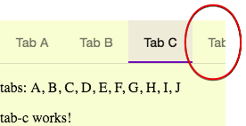

**mat-tab-nav-bar**
  
No pagination when the list of tab labels exceeds the width of the header:
 

  
https://github.com/angular/material2/issues/11662
  
What are the steps to reproduce?
 
https://stackblitz.com/github/MyTempGitForCommunity/Angular6NavTabsNoPagination?file=src%2Fapp%2Fapp.component.html
